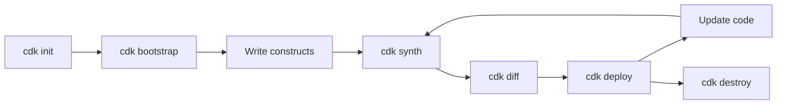

# AWS CDK Full Life-Cycle Example

This article walks through a complete, end-to-end example of working with the AWS Cloud Development Kit (CDK)—from installing the tools to writing, deploying, updating, and finally tearing down a real application stack. The goal is to show how every phase of the CDK life-cycle fits together in a realistic workflow.

We will build a small serverless application: an **API Gateway** endpoint backed by a **Lambda** function that stores and retrieves items from a **DynamoDB** table.

## 1. Prerequisites

Before starting, make sure you have:

- An AWS account and credentials configured (for example, via `aws configure`).
- **Node.js** installed (the CDK CLI runs on Node.js even when you write CDK code in other languages).
- The AWS CDK Toolkit installed globally:

```bash
npm install -g aws-cdk
cdk --version
```

## 2. Initialize the Project

Create a new directory and scaffold a TypeScript CDK app:

```bash
mkdir my-serverless-app && cd my-serverless-app
cdk init app --language typescript
```

This generates a project structure:

```
my-serverless-app/
├── bin/
│   └── my-serverless-app.ts   # App entry point
├── lib/
│   └── my-serverless-app-stack.ts  # Your stack definition
├── test/
├── cdk.json                   # CDK configuration
├── package.json
└── tsconfig.json
```

Install the construct libraries used in this example:

```bash
npm install aws-cdk-lib constructs
```

## 3. Bootstrap the Environment

The CDK needs a one-time bootstrap per account/region. This provisions an S3 bucket and IAM roles the CDK uses to store assets and perform deployments:

```bash
cdk bootstrap aws://123456789012/us-east-1
```

## 4. Write the Lambda Handler

Create the function code at `lambda/handler.ts`:

```typescript
import { DynamoDBClient } from '@aws-sdk/client-dynamodb';
import {
  DynamoDBDocumentClient,
  PutCommand,
  GetCommand,
} from '@aws-sdk/lib-dynamodb';

const client = DynamoDBDocumentClient.from(new DynamoDBClient({}));
const TABLE_NAME = process.env.TABLE_NAME!;

export const handler = async (event: any) => {
  if (event.httpMethod === 'POST') {
    const body = JSON.parse(event.body ?? '{}');
    await client.send(
      new PutCommand({ TableName: TABLE_NAME, Item: { id: body.id, data: body.data } }),
    );
    return { statusCode: 201, body: JSON.stringify({ message: 'Created' }) };
  }

  const id = event.queryStringParameters?.id;
  const result = await client.send(
    new GetCommand({ TableName: TABLE_NAME, Key: { id } }),
  );
  return { statusCode: 200, body: JSON.stringify(result.Item ?? {}) };
};
```

## 5. Define the Stack

Describe the infrastructure in `lib/my-serverless-app-stack.ts`:

```typescript
import * as cdk from 'aws-cdk-lib';
import { Construct } from 'constructs';
import * as dynamodb from 'aws-cdk-lib/aws-dynamodb';
import * as apigateway from 'aws-cdk-lib/aws-apigateway';
import { NodejsFunction } from 'aws-cdk-lib/aws-lambda-nodejs';

export class MyServerlessAppStack extends cdk.Stack {
  constructor(scope: Construct, id: string, props?: cdk.StackProps) {
    super(scope, id, props);

    // DynamoDB table
    const table = new dynamodb.Table(this, 'ItemsTable', {
      partitionKey: { name: 'id', type: dynamodb.AttributeType.STRING },
      billingMode: dynamodb.BillingMode.PAY_PER_REQUEST,
      removalPolicy: cdk.RemovalPolicy.DESTROY, // For demo only
    });

    // Lambda function
    const fn = new NodejsFunction(this, 'ItemsHandler', {
      entry: 'lambda/handler.ts',
      handler: 'handler',
      environment: { TABLE_NAME: table.tableName },
    });

    // Grant the function read/write access to the table
    table.grantReadWriteData(fn);

    // API Gateway REST API backed by the Lambda
    const api = new apigateway.LambdaRestApi(this, 'ItemsApi', {
      handler: fn,
    });

    new cdk.CfnOutput(this, 'ApiUrl', { value: api.url });
  }
}
```

Notice how L2 constructs reduce boilerplate: `table.grantReadWriteData(fn)` automatically creates the correct IAM policy, and `LambdaRestApi` wires up the integration for you.

## 6. Synthesize the Template

Generate the CloudFormation template to inspect what will be deployed:

```bash
cdk synth
```

This outputs the synthesized CloudFormation (to the console and the `cdk.out/` directory) without deploying anything—useful for review and for committing to version control.

## 7. Review Changes with a Diff

Before deploying, compare your code against what is currently deployed:

```bash
cdk diff
```

On the first deployment, everything shows as new (`+`). On later runs, `cdk diff` highlights exactly what will be added, modified, or removed, along with IAM and security-related changes.

## 8. Deploy the Stack

Deploy the application to AWS:

```bash
cdk deploy
```

The CDK prompts you to approve any security-sensitive changes (such as new IAM permissions), then creates the CloudFormation stack. When it finishes, the `ApiUrl` output is printed so you can test the endpoint:

```bash
# Create an item
curl -X POST "$API_URL" -d '{"id":"1","data":"hello"}'

# Retrieve it
curl "$API_URL?id=1"
```

## 9. Update the Stack

Infrastructure evolves. Suppose you want to enable point-in-time recovery on the table. Update the construct:

```typescript
const table = new dynamodb.Table(this, 'ItemsTable', {
  partitionKey: { name: 'id', type: dynamodb.AttributeType.STRING },
  billingMode: dynamodb.BillingMode.PAY_PER_REQUEST,
  pointInTimeRecovery: true, // New setting
  removalPolicy: cdk.RemovalPolicy.DESTROY,
});
```

Then run the diff-and-deploy cycle again:

```bash
cdk diff     # Shows only the changed property
cdk deploy   # Applies the update via a CloudFormation change set
```

CloudFormation performs the update in place, and rolls back automatically if anything fails.

## 10. Test and Iterate

During active development, you can speed up the inner loop with hotswap deployments, which bypass a full CloudFormation update for supported resources like Lambda code:

```bash
cdk deploy --hotswap   # Faster iteration; use in development only, not production
```

## 11. Add Automated Tests (Optional but Recommended)

Because the CDK uses real programming languages, you can unit-test your infrastructure. Using Jest with the CDK assertions module:

```typescript
import { Template } from 'aws-cdk-lib/assertions';
import * as cdk from 'aws-cdk-lib';
import { MyServerlessAppStack } from '../lib/my-serverless-app-stack';

test('creates a DynamoDB table', () => {
  const app = new cdk.App();
  const stack = new MyServerlessAppStack(app, 'TestStack');
  const template = Template.fromStack(stack);

  template.resourceCountIs('AWS::DynamoDB::Table', 1);
  template.hasResourceProperties('AWS::DynamoDB::Table', {
    BillingMode: 'PAY_PER_REQUEST',
  });
});
```

Run the tests:

```bash
npm test
```

## 12. Integrate into CI/CD

In a pipeline, the deployment steps are automated. A typical flow runs:

```bash
npm ci
npm test
cdk synth
cdk deploy --require-approval never
```

For more advanced setups, **CDK Pipelines** (`aws-cdk-lib/pipelines`) can define a self-mutating pipeline in code that builds, tests, and deploys your stacks across multiple environments.

## 13. Tear Down

When the environment is no longer needed, remove all resources to avoid ongoing charges:

```bash
cdk destroy
```

Because the demo table uses `RemovalPolicy.DESTROY`, it is deleted along with the stack. In production, you would typically use `RETAIN` for stateful resources to protect data.

## Life-Cycle Summary



| Phase | Command | Purpose |
| --- | --- | --- |
| Initialize | `cdk init` | Scaffold a new CDK project |
| Bootstrap | `cdk bootstrap` | Prepare the account/region for deployments |
| Synthesize | `cdk synth` | Generate the CloudFormation template |
| Preview | `cdk diff` | Review changes before deploying |
| Deploy | `cdk deploy` | Create or update the stack |
| Iterate | `cdk deploy --hotswap` | Fast development-time updates |
| Test | `npm test` | Validate infrastructure with assertions |
| Destroy | `cdk destroy` | Tear down all resources |

## Conclusion

This full life-cycle example shows how the AWS CDK supports every stage of infrastructure development—initializing a project, bootstrapping, writing constructs, synthesizing and reviewing changes, deploying, updating, testing, automating in CI/CD, and finally destroying resources. By treating infrastructure like application code, the CDK brings a familiar, iterative, and testable engineering workflow to provisioning cloud resources on AWS.
